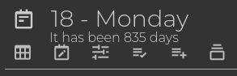
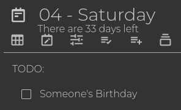

# countdown-days-widget :)

[中文说明](README_CN.md)

Countdown Days widget for Trilium is a handy tool that adds a message displaying the relative day count from today under the note title in your journal.

# ScreenShots

Past time

Future time

i18n support, e.g. Chinese

# How to install

1. Download the zip file from [release page](https://github.com/Nriver/countdown-days-widget/releases).
2. Right click note tree in Trilium and click import, uncheck `Safe Import`.
3. Restart Trilium Notes or use `ctrl+r` to reload the interface.
4. Open any journal note, you will see a message under the note title.
5. Have fun.

# Helpful Tips

1. You can tweak configs in the `config` subnote.
2. i18n support, check the `translations` subnote for the translated texts.

# Why I made this?

I find it useful to have an idea of how many days are left until a certain event. This way, I can keep track of how much time I have before an exam or how many days I need to work until my next big vacation or perhaps just someone's birthday.

Additionally, when I look back at my old journals, I sometimes come across moments when I did something stupid or interesting, and I wonder, "How long ago did I do that?" Oh, goodness, it's already been over 1000 days since I started https://github.com/Nriver/trilium-translation ?

Well, just for fun.
