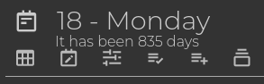
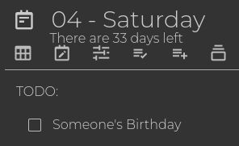
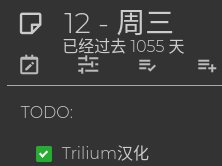

# 倒计时天数小部件 :)

[Chinese explanation](README_CN.md)

Trilium的倒计时天数小部件是一个方便的工具，它在您的日志中的笔记标题下方添加了一个显示与今天相对天数的消息。

# 屏幕截图

过去的时间

未来的时间

i18n支持，例如中文

# 如何安装

1. 从[发布页面](https://github.com/Nriver/countdown-days-widget/releases)下载zip文件。
2. 在Trilium中右键单击笔记树，然后单击导入，取消选中“安全导入”。
3. 重新启动Trilium Notes或使用`ctrl+r`重新加载界面。
4. 打开任何日志笔记，您将在笔记标题下看到一条消息。
5. 玩得开心。

# 有用的提示

1. 您可以在`config`子笔记中调整配置。
2. i18n支持，请检查`translations`子笔记以获取已翻译的文本。

# 为什么我做了这个？

我发现知道距离某个事件还有多少天很有用。这样，我就可以追踪离考试还有多少时间，或者我需要工作多少天才能到达下一个长假，或者可能只是某个人的生日。

此外，当我回顾我的旧日记时，有时我会遇到自己做了愚蠢或有趣的事情的时刻，然后我会想：“我做那件事已经多久了？”哦，天哪，自从我开始 https://github.com/Nriver/trilium-translation 以来已经过去了1000多天了？

嗯，只是为了好玩。